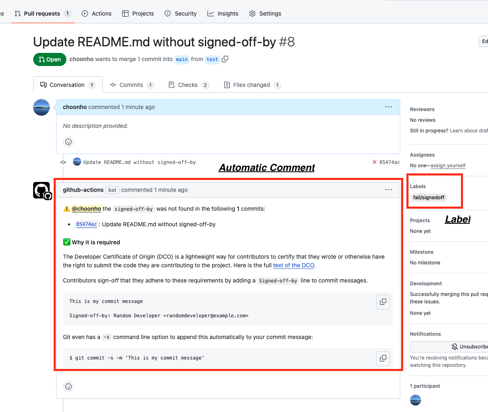

# Check signed-off-by in PR

[](https://github.com/super-linter/super-linter)


A Github Action that checks the commits of the current PR and fails if it contains unsigned commits.
It places a comment on the PR with the result of the check. It also add labels ***pass/signedoff*** to the PR.

## Usage

```
# .github/workflows/check-pull-request.yml
name: Check Pull Request

on:
  pull_request_target:

jobs:
  check-pull-request:
    name: Check Pull Request
    runs-on: ubuntu-latest
    permissions:
      pull-requests: write
    steps:
      - name: Check signed commits
        id: review
        uses: cloudforet-io/check-pr-action@v1
        with:
          token: ${{ secrets.GITHUB_TOKEN }}

      - name: Notify Result
        if: ${{ steps.review.outputs.signedoff == 'false' }}
        run: |
          echo "The review result is ${{ steps.review.outputs.signedoff }}"
          exit 1
```

## Outputs

| variable | description |
| --- | --- |
| signedoff |  true or  false |



## More information

The reason to prefer **pull_request_target** over **pull_request** is that **pull_request_target** allows the action to run with the permissions of the user who opened the PR, which is necessary to add a comment to the PR.
The Github token that comes with **pull_request** event does not have the necessary permissions to add a comment to the PR.

```
on:
  pull_request_target:

jobs:

    ...

    permissions:
     pull-requests: write
```


